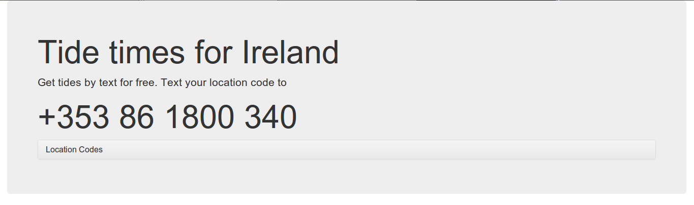
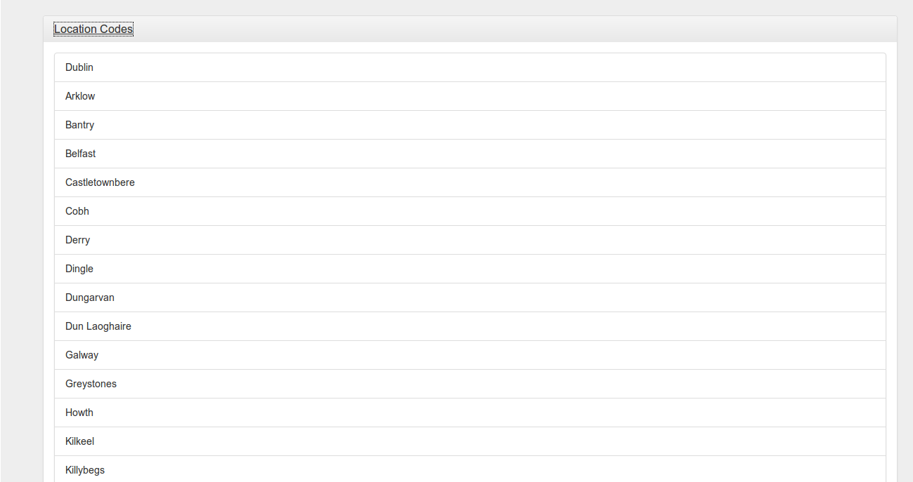
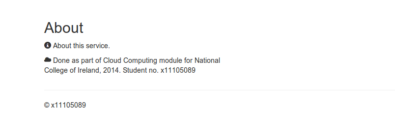

Cloud Computing Project Report
==============================

####Student No.
x11105089

####Course
BSHCE

####Application
Irish Tide Times

## Introduction
**Introduce your project and the rationale for taking on the particular project, in particular discuss the reasons behind selecting the data sources that you selected.**

The aim of the project is to provide an SMS service for retrieving times of high and low tides at specific locations around the country. The service could be used by both professionals and hobbyists who need this information but may not have ready access to mobile internet due to geographic location or weather conditions (anglers, boaters, surfers etc.).

A user sends an SMS to a given Irish phone number with their location code, and the times for first low, first high, second low and second high tides are sent in a reply SMS to the user. If an erroneous location is given, the reply instead gives a list of possible location codes.

**Twilio** (https://www.twilio.com/) is used to provide the phone number and to handle incoming SMS. Twilio was chosen for several reasons. First, the documentation available for Twilio is second to none. Clear example of how to implement the API are given for a variety of different programming languages and frameworks. Twilio also proved to have excellent customer service and were helpfully able to supply a "beta" Irish telephone number which could handle SMS (this was important as it would be unfeasible if users had to sent an SMS to a UK number, incurring a cost). Another reason Twilio was used was that it did not prove to be cost-prohibitive, with both receiving and sending SMS costing a fraction of a cent. A Twilio account also provides useful records of each SMS sent and received, as well as affording flexibility in how incoming SMS are handled (eg. limiting the number of SMS per day and so on).

The second data source used was the tides page from The Irish Times at http://www.irishtimes.com/weather/tides. Due to anecdotal evidence this appears to be the canonical source used by anglers. Having reference these tides myself for many years I know them to be accurate. Secondly, using a well-established and reliable website such as the Irish Times' ensures small chance of the information being unavailable on a given day. The tide information is also presented in plain HTML which proved to be relatively straightforward to parse.

## Technical Overview

### User Interface Design
The choice was made to keep the user interface simple as the main goal of the site is to explain what the service is, give the phone number required as well as the instructions for using it.

Twitter Bootstrap was effective for presenting this information in a clear and concise manner.

For the headline of the site, the Bootstrap feature "Jumbotron" was used (figure 1).

On the Jumbotron, the overview of the site and the SMS phone number are clearly displayed, forming a "call to action".

For the list of location codes, Bootstrap's "Accordion" was used (figure 2). This allowed the location codes to be hidden until a user clicks, keeping the site looking uncluttered. When the user clicks again, the accordion closes. The Accordion was useful for displaying the location codes clearly.

For the About section at the bottom of the page, a Bootstrap column was used to contain the information. Two Bootstrap "glyphicons" were used to highlight the infor,ation points (figure 3).

### Data Source 1
You are required to go into detail, including code snippets of how you have integrated the data source into your application. All references should be provided identifying all suitable sources used for the development of the project.

### Data Source 2
You are required to go into detail, including code snippets of how you have integrated the data source into your application. All references1 should be provided identifying all suitable sources used for the development of the project.

Deployment strategy
This section requires you to discuss the deployment strategy that you have implemented for your project. Discuss both platforms that you have deployed your application onto including a detailed process demonstrating your understanding of the process. 

Platform One
This sub section should describe the first platform that you have deployed your application onto, including a link to show that you application is still running at the time of the demonstration. If, for some reason that your application will not be running at the time of the presentation you can record you accessing the application through a browser where the location is clearly seen.

Platform Two
This sub section should describe the first platform that you have deployed your application onto, including a link to show that you application is still running at the time of the demonstration. If, for some reason that your application will not be running at the time of the presentation you can record you accessing the application through a browser where the location is clearly seen.

